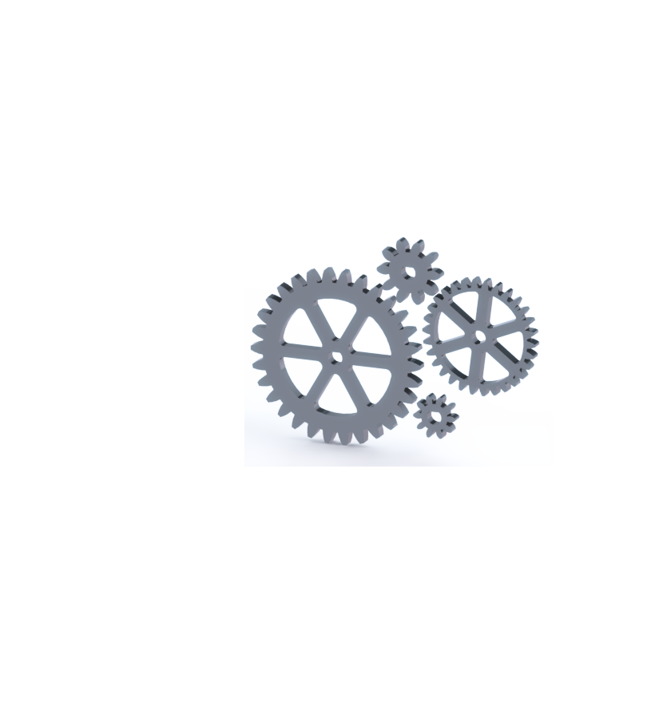
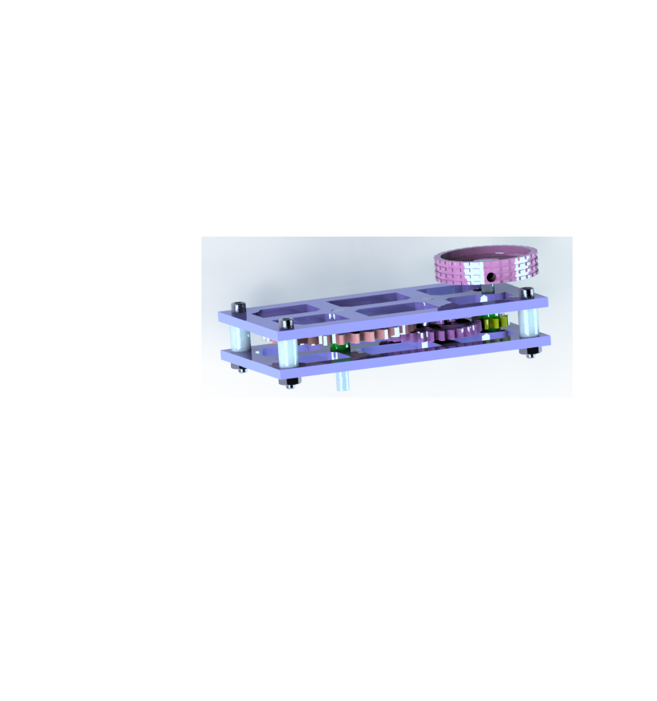
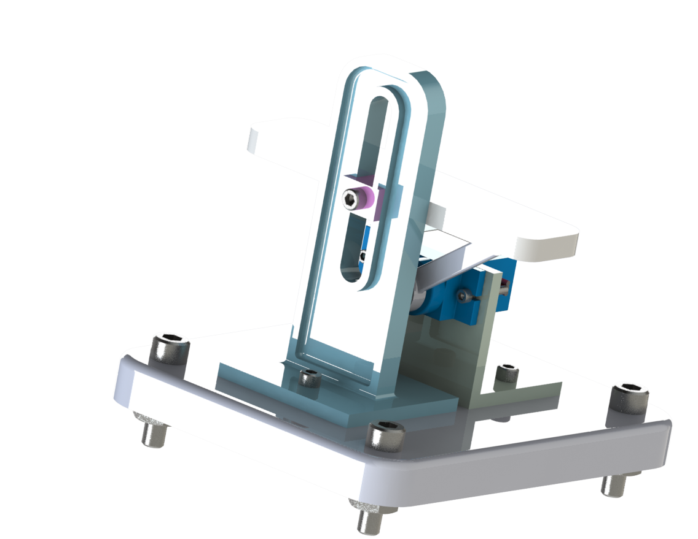
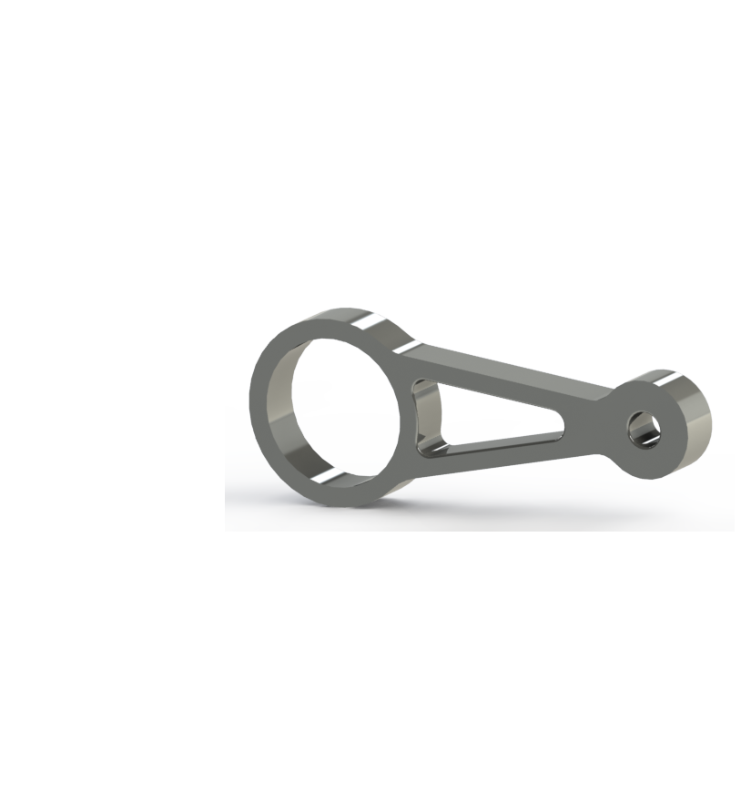

## Gears 

### Description
  In this Assignment, you create 4 different gears with designated amount of teeth and module 
  
### Lessons Learned
  I learned a more in depth introduction and explanation of the usage of global variables, and I learned how to specify dimensions to 
 specific dimensions. I learned some of the aspects that define a gears dimensions and equations that go along with them. I also
 learned how to make dimensions equations.
### Images

## Gearbox 

### Description
  You take the gears made in the previous assignment you add new pieces like plates, knods, spacers, and axles to make a system that when 
 you turn an axle it causes the gears to turn
### Lessons Learned
  I learned some new mates while doing this assignment; I learned how to do a gear mate and a distance mate. With gear mates you have to
 click on the axles of the gears then put in the appropriate amount of teeth and if you lined them up and set the direction in the 
 correct way you should have a working gear mate. I also hadd never you a revolved cut so I was able to become familar with those. 
### Images

## Motion Study

### Description
  Make an assembly that involves a servo and motion study that has gravity.
### Lessons Learned
  I learned What a motion study is and how to use it. In motion Study I learned many of the aspects of a motion study I added gravity to the shelf and it fell onto the servo arm which got a motor study added to it to make it rotate and move the shelf back up. I also learned what shelf. Shelf in a sense hollows out a face of a part. 
### Images

## Stress Analysis

### Description
  Create a part then add features and change dimensions to make it sturdier.
### Lessons Learned
  I learned what Stress Analysis was, how to use it, and how it helps. Stress analysis can show you what parts of a part which are weak and vulnerable whenever force is applied. I also learned Von Mises stress which is used to show the specific region that would undergo the greatest stress.
### Images

